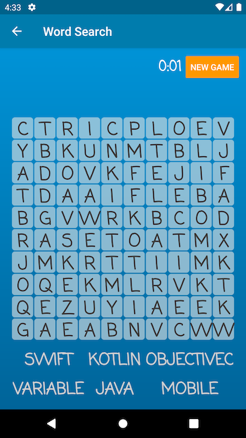
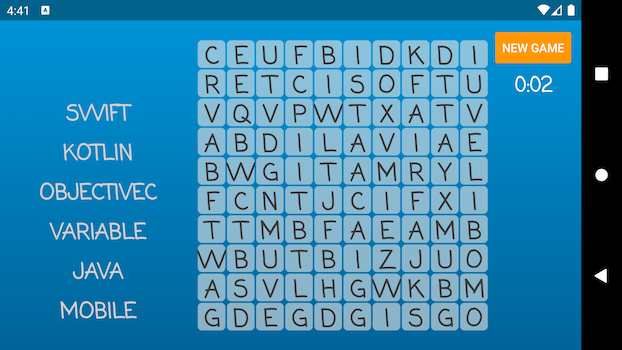
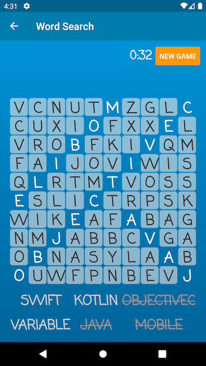
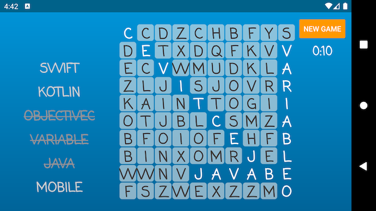
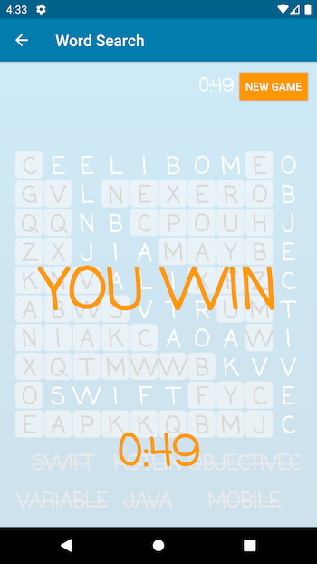
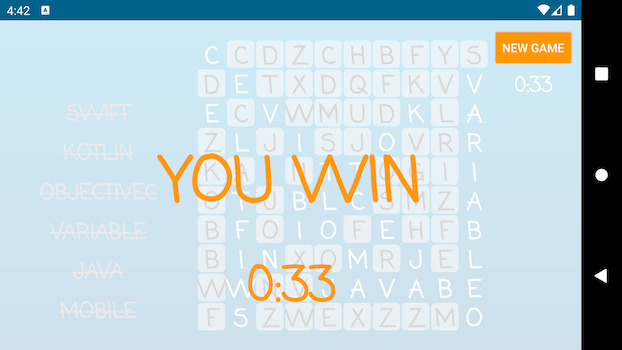

# word-search-app
Word Search App for Shopify

## Features

### Required
- Create a word search mobile app for Android. :white_check_mark:
- The word search should have at least a 10x10 grid. :white_check_mark:
- Include at least the following 6 words: Swift, Kotlin, ObjectiveC, Variable, Java, Mobile. :white_check_mark:
- Keep track of how many words a user has found. :white_check_mark:
- Make sure it compiles successfully. :white_check_mark:

### Bonus
- Randomize where the words are placed. :white_check_mark:
- Make a slick UI with smooth animations. :white_check_mark:
- Make it look good in portrait and landscape. :white_check_mark:
- Allow the user to find the words by swiping over the words. :white_check_mark:

### Additional
- Timer to evaluate how fast the user found the words. :white_check_mark:
- 3 difficulties: Easy (10x10 grid, 6 words), Normal (12x12 grid, 7 words), Hard (15x15 grid, 8 words). :white_check_mark:
- New game button. :white_check_mark:
- Words in 4 directions (vertical, horizontal and 2 diagonal) :white_check_mark:
- Words can be reversed. The user can select them reversed, and it will still work. :white_check_mark:

## Screenshots
These are the screenshots of the game running.

### Game Start
These are the screenshots of the game when no word has been found.

### Middle Game
These are the screenshots of the game when some words have been found, but not all of them.

### End of the Game
These are the screenshots of the game when all words have been found.

### Difficulty choosing
This is the screenshot from before the game start, when the user chooses the difficulty of the game.

